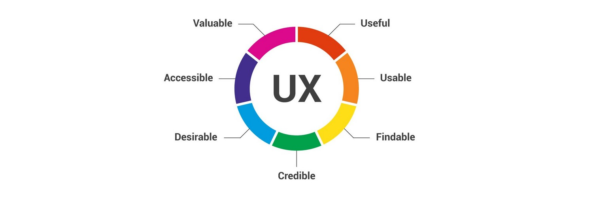

# **User Experience Design**

The field of User Experience spans across a breadth of focuses, often leading to confusion about what exactly it covers. In essence, User Experience is a human-centered approach to solving problems, but the lens and definition may change depending on which aspect you're looking at.

## **1. Introduction**
- [So What Do you Do?: 16 Experts on How to Explain UX Design](https://xd.adobe.com/ideas/career-tips/16-experts-explain-ux-design-and-what-they-do/)
- [Universal Principles of User Experience Design](https://xd.adobe.com/ideas/guides/evolution-user-experience-design-intro/)
- [Components of any User Experience Process](https://blog.adobe.com/en/2017/08/04/ux-process-what-it-is-what-it-looks-like-and-why-its-important.html#gs.enzyxi)
- [Definition of a Good User Experience Design](https://xd.adobe.com/ideas/principles/web-design/what-makes-good-ux/)
- [The 4 Golden Rules of UI Design](https://xd.adobe.com/ideas/process/ui-design/4-golden-rules-ui-design/)
- [Examples of Good User Experience Design](https://xd.adobe.com/ideas/process/ui-design/good-bad-ux-design-examples/)

## **2. User Experience Research**
- [What is User Experience Research?](https://xd.adobe.com/ideas/process/user-research/)
- [User Research & Testing](https://youtu.be/FthxZenH5Xo)
- [Competitor User Experience Research](https://xd.adobe.com/ideas/process/user-research/guide-to-competitive-analysis-ux-design/)
- [Personas and User Profiles](https://xd.adobe.com/ideas/process/user-research/putting-personas-to-work-in-ux-design/)
- [Types of UX Research](https://xd.adobe.com/ideas/process/user-research/user-research-best-practices-methodologies/)
- [Qualitative and Quantitative Research](https://xd.adobe.com/ideas/guides/comprehensive-guide-user-experience-ux-research-methods-part-2/)
- [Observations](https://xd.adobe.com/ideas/process/user-research/user-interview-questions-ux-research/)
- [Understanding User-Testing Data and Results](https://xd.adobe.com/ideas/process/user-research/translating-user-research-into-ux-design/)

## **3. Visual Design**
- [Definition](https://xd.adobe.com/ideas/principles/web-design/role-visual-design-user-experience/)
- [Atomic Design](https://xd.adobe.com/ideas/process/ui-design/atomic-design-principles-methodology-101/)
- [Elements of any Visual Design](https://xd.adobe.com/ideas/principles/web-design/role-visual-design-user-experience/)
  - [Language](https://xd.adobe.com/ideas/guides/universal-principles-user-experience-design-language-typography-part-2/)
  - [Color and Shape](https://xd.adobe.com/ideas/principles/web-design/ux-of-color-palettes/)
  - [Imagery](https://xd.adobe.com/ideas/process/ui-design/effective-use-images-graphics-ux-design/)
  - [Typography](https://xd.adobe.com/ideas/process/ui-design/typography-in-ui-design/)
  - [Buttons](https://xd.adobe.com/ideas/process/ui-design/button-design-integration-ui/)
- [Composition of Visual Design Elements](https://xd.adobe.com/ideas/process/ui-design/design-composition-key-principles/)
  - [Structure & Grid](https://xd.adobe.com/ideas/process/wireframing/layout-grids-for-wireframes/)
  -  [Hierarchy of Content](https://xd.adobe.com/ideas/process/information-architecture/visual-hierarchy-in-ux-design/)
  - [States](https://xd.adobe.com/ideas/process/ui-design/designing-interactive-buttons-states/)
- [Principles for Designing Visual Elements for Different Platforms & Screen Sizes](https://xd.adobe.com/ideas/principles/web-design/ux-design-strategy-for-multiple-devices/)
- [Examples of Visual Design Elements across multiple Platforms & Screen Sizes](https://xd.adobe.com/ideas/process/ui-design/adaptive-design-vs-responsive-design/)

## **4. User Experience Design Strategy**
- [Information Architecture](https://xd.adobe.com/ideas/process/information-architecture/introductory-guide-to-information-architecture/)
  - [Techniques & Best Practices for developing an Information Architecture](https://xd.adobe.com/ideas/process/information-architecture/information-architecture-users-content-context/)
  - [Developing an Information Architecture for a Software Product or Solution](https://xd.adobe.com/ideas/process/information-architecture/information-architecture-templates-for-web-design/)
  - [Examples](https://xd.adobe.com/ideas/process/information-architecture/information-architecture-examples/)
- **Sitemap**
  - Visual sitemaps are a hierarchical diagram that shows the Information Architecture of a website. It gives you a visual representation of the site’s organization and how different sections are linked together.
  - [Developing a Sitemap for a Website](https://xd.adobe.com/ideas/process/information-architecture/sitemap-and-information-architecture/)
  - [Examples](https://xd.adobe.com/ideas/process/information-architecture/visual-sitemap-examples-website-designs/)
- [Navigation and Hierarchy?](https://xd.adobe.com/ideas/process/information-architecture/information-architecture-navigation/)
  - [Taxonomy and Metadata](https://xd.adobe.com/ideas/process/information-architecture/organizing-information-taxonomies-metadata/)
  - [Examples of Navigation Architecture and Hierarchy of Information](https://xd.adobe.com/ideas/process/information-architecture/website-navigation-design-best-practices/)

## **5. Mock Ups**
- [Different types of Design Mock-Ups](https://xd.adobe.com/ideas/process/prototyping/fundamentals-wireframing-prototyping/)
- [User personas, scenarios and stories](https://xd.adobe.com/ideas/process/user-research/user-journey-vs-user-flow/)
- [Design ideation and sketching](https://xd.adobe.com/ideas/guides/comprehensive-guide-product-design-research-user-analysis-ideation-part-2/)
- [Storyboarding User Experiences](https://xd.adobe.com/ideas/process/user-research/storyboard-ux-design/)
- [Design Wireframes](https://xd.adobe.com/ideas/process/wireframing/wireframing-a-blueprint-to-your-site/)
- [Design prototyping and types of prototypes](https://xd.adobe.com/ideas/process/prototyping/low-fi-and-hi-fi-prototyping/)